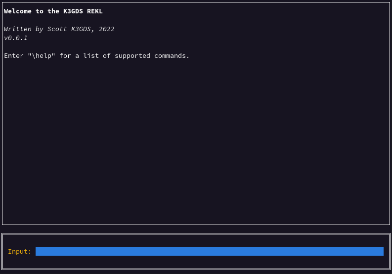

# K3GDS REKL

The K3GDS REKL (Read, Eval, Key, Loop) gives an interactive repl-like experience for amateur radio morse code (CW) keying.

This was created out of a need for a more user-friendly way to send CW from Linux.  There is a popular contest logging application for Windows that has a great CW sending functionality, but I have not been able to run that application on Linux.  Of course, the REKL doesn't have any logging functionality, but I only need that a couple weekends a year anyways.

## Interface Compatibility

At the moment, the cwkeyer package has a Key that beeps and a Key that sets the DTR signal on a serial port.  The latter one does everything I need to interface with my radios, and I'm unsure what might be useful for other radios and interfaces.

If you need something else, make an issue or pull request on the [cwkeyer](https://www.github.com/scottmcleodjr/cwkeyer) project first.  I'm happy to make this useful to more people.

## Current Functionality

The application supports these functionalities through either entered commands or hotkeys:

- **Send CW** You can enter text and it will send as CW asynchronously.  Subsequent inputs (ie, a speed change) will take place immediately. 
- **Stop CW** You can stop the CW that is sending.  This is done by draining the send queue on the cwkeyer.Keyer.
- **CW Speed Controls:**
  - **Increment** You can increase the speed by 1 WPM.
  - **Decrement** You can decrease the speed by 1 WPM.
  - **Get Speed** You can see the current speed in the event view.
  - **Set Speed** You can set the speed to any value (between the minimum of 5 WPM and maximum of 50 WPM).
- **Help** You can print a list of supported commands and hotkeys to the event view.
- **Clear** You can clear the event view.
- **Quit** You can exit the program.

## Roadmap

- **Memory** We want to attach messages to the numbers 1-0 on the keyboard.  (Well, actually, Shift + the number so that it won't conflict with sending numbers.)  You should be able to send those saved messages and print all the currently saved messages to the event view.
- **Serialized Config** If we have saved messages, we also need a way to persist them across sessions.  This will involve saving the config down to a file that can be loaded through a REKL command or a command line flag.
